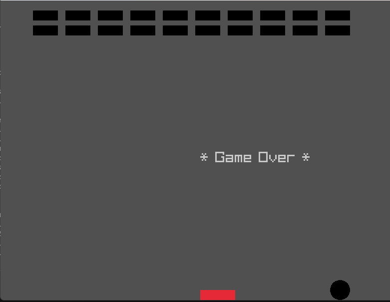

# A simple Ping Pong Game

The intentions here is to practice my c/c++ skills (that are very bad at the moment)



Yes that is the current state, sorry.

## Installation

If you wnat to test it just go to the raylib github page and find the way to install in yours OS: https://github.com/raysan5/raylib

## Running

If you are using g++, then the command is something like: 

```
g++ main.cpp -o .\build\main -lraylib -lgdi32 -lwinmm.
```

If you are using other compiler, then you know, something similar with that (remember to look raylib docs if have problem).

## Roadmap

- Create a funcional ping pong like game (I forget the name of this type of game, but we have blocks to destroy using the ball, and we can not leave the ball hit the wall behind)
- Have some other nivels, like 3 at the maximum.


## Requirements

- It needs to be some kind of fun to play
- with sound and blocks destroy effects


## Thanks to me

Thanks to me for being me
